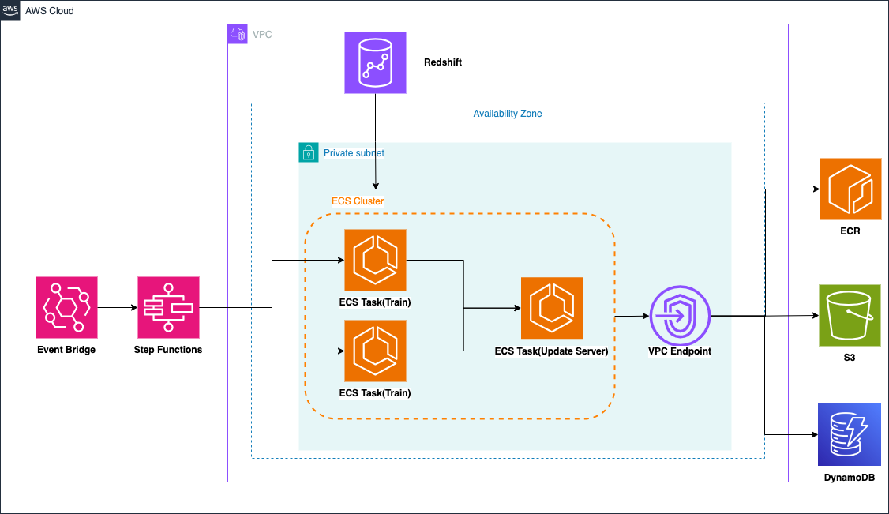

# AWS MLOps Practice
This repository provides practice code to build MLOps on AWS.
This service specifically focuses on Operation in MLOps.
The Python application code is meant to be referenced from the following GitHub: https://github.com/nsakki55/aws-mlops-handson
<!-- FIXME: url
Slide[japanese]: https://sample -->

## Key Features
### Python Development Environment
We guide you through setting up a Python development environment that ensures code quality and maintainability.
This environment is carefully configured to enable efficient development practices and facilitate collaboration.

### Parallel Train Pipeline and Model Versioning
This repository includes the implementation of a training pipeline.
This pipeline covers the stages, including data preprocessing, model training, and evaluation.
This repository also allows multiple models to be trained in parallel and finally the inference server can be updated.
We can also use DynamoDB to version control your models and sanity check before model serving.

### Inference Server
This repository provides an implementation of a prediction server that serves predictions based on your trained CTR prediction model.
Canary release is also achieved by separating the ALB target group.

### Monitoring System
We offer a comprehensive monitoring system using Grafana and Prometheus.
Software metrics of the inference server, predictions, and data drift in the learning pipeline can also be detected

### AWS Deployment
To showcase industry-standard practices, this repository guide you in deploying the training pipeline, inference server and dashboard on AWS.


## AWS Infra Architecture
AWS Infra Architecture made by this repository.

### ML Pipeline


### Inference Server


## Requirements
| Software                   | Install (Mac)              |
|----------------------------|----------------------------|
| [pyenv](https://github.com/pyenv/pyenv#installation)             | `brew install pyenv`       |
| [Poetry](https://python-poetry.org/docs/#installation)           | curl -sSL https://install.python-poetry.org &#x7C; python3 - |
| [direnv](https://formulae.brew.sh/formula/direnv)           | `brew install direnv`      |
| [Terraform](https://developer.hashicorp.com/terraform/tutorials/aws-get-started/install-cli#install-terraform)    | `brew install terraform`   |
| [Docker](https://docs.docker.com/desktop/install/mac-install/) | install via dmg |
| [docker-buildx](https://matsuand.github.io/docs.docker.jp.onthefly/buildx/working-with-buildx/) |  `brew install docker-buildx`  |
| [awscli](https://docs.aws.amazon.com/cli/latest/userguide/getting-started-installjkkkkj.html) | `curl "https://awscli.amazonaws.com/AWSCLIV2.pkg" -o "AWSCLIV2.pkg"` |

## Setup
### Install Python Dependencies
Use `pyenv` to install Python 3.11.7 environment
```bash
$ pyenv install 3.11.7
$ pyenv local 3.11.7
```

Use `poetry` to install library dependencies
```bash
$ poetry install
```

### Configure environment variable
Use `direnv` to configure environment variable
```bash
$ cp .env.example .env
$ direnv allow .
```
Set your environment variable setting
```bash
AWS_REGION=ap-northeast-1
AWS_ACCOUNT_ID=
AWS_PROFILE=mlops-practice
AWS_ALB_DNS=
USER_NAME=
S3_BUCKET=${USER_NAME}-mlops-practice

TF_VAR_aws_region=${AWS_REGION}
TF_VAR_aws_profile=${AWS_PROFILE}
TF_VAR_aws_account_id=${AWS_ACCOUNT_ID}
TF_VAR_name=${USER_NAME}
```

### Create AWS Resources
Use terraform to create aws resources.
Apply terraform
```bash
$ make init
$ make plan
$ make apply
```

### Prepare train data
unzip train data
```bash
$ unzip data.zip
```

upload train data to S3
```bash
$ make upload
```

## Code static analysis tool
| Tool                   | Usage              |
|----------------------------|----------------------------|
| [ruff](https://docs.astral.sh/ruff/)           | Format code style, format import statement, and code quality check check  |
| [mypy](https://mypy.readthedocs.io/en/stable/)    |  Static type checking |
| [pytest](https://docs.pytest.org/en/8.2.x/)   |  Test Code |
| [tox](https://tox.wiki/en/4.15.0/)   |  Virtual env for develop |


## Usage
Build ML Pipeline
```bash
$ make build-ml
```

Run ML Pipeline
```bash
$ make run-ml
```

Build Predict API
```bash
$ make build-predictor
```

Run Predict API locally
```bash
$ docker compose up --build
```

Shutdown Predict API locally
```bash
$ docker compose down
```

Request Local Predict API
```bash
$ make predict
```

Run formatter
```bash
$ make format
```

Run pytest, ruff, mypy
```bash
$ tox
```

There are many more commands, check the Makefile.
